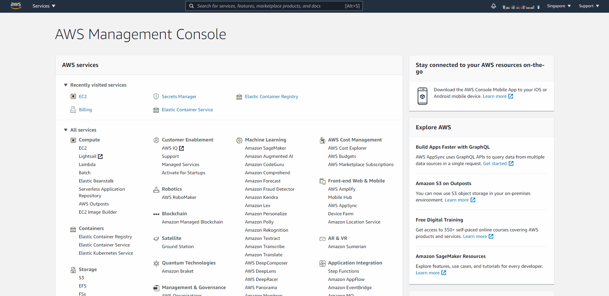
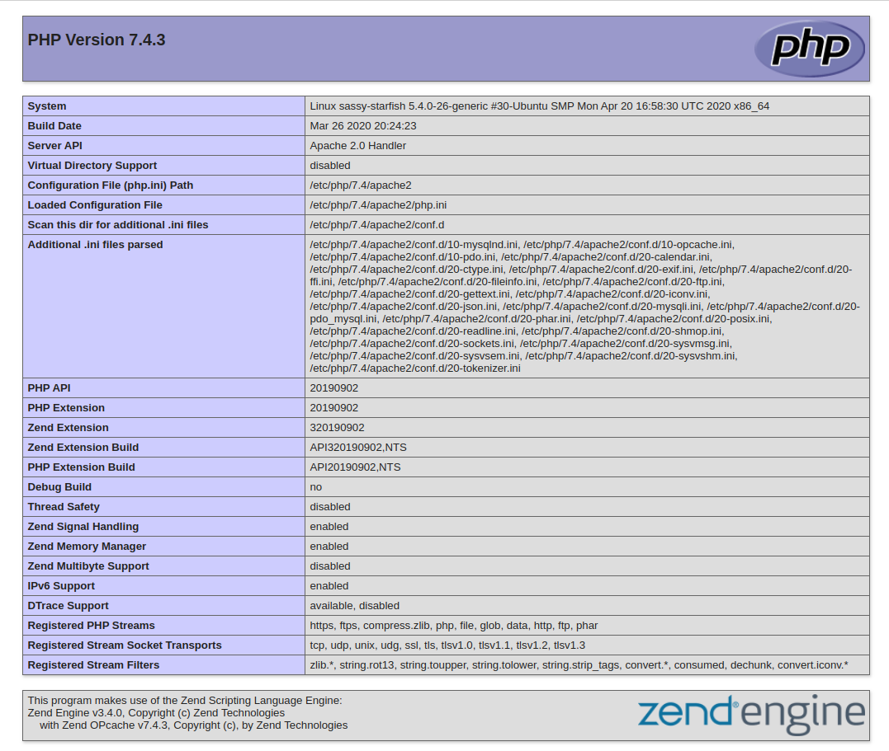

# LAMP STACK IMPLEMENTATION
This project is based on web stack implementation (LAMP STACK) on Amazon Web Service (AWS)

##  What does technology stack means?
A technology stack is a set of frameworks and tools used to develop a software product. This set of frameworks and tools are very specifically chosen to work together in creating a well-functioning software. They are acronymns for individual technologies used together for a specific technology product. some examples are:- **LAMP** (Linux, Apache, MySQL, PHP or Python, or Perl), **LEMP** (Linux, Nginx, MySQL, PHP or Python, or Perl), **MERN** (MongoDB, ExpressJS, ReactJS, NodeJS) and **MEAN** (MongoDB, ExpressJS, AngularJS, NodeJS

##  Steps in implementing LAMP stack
+  [x] 0.  Preparing virtual linux server in AWS 
    + Create and Login to your AWS account. 
    + Select your preferred region (the closest to you) and launch a new Elastic Cloud Compute (EC2) instance of t2.micro family with Ubuntu Server 20.04 LTS (HVM).
    
      + **IMPORTANT** – save your private key (.pem file) securely and do not share it with anyone! If you lose it, you will not be able to connect to your server ever again!
      + Also ensure your Security group allows incoming traffic from port 22, which is the default prtocol for **SSH** connection.
    + Connecting to EC2 terminal
      + Change directory into the loacation where your PEM file is. Most likely will be in the Downloads folder

            cd ~/Download
      + Change premissions for the private key file (.pem), otherwise you can get an error "Bad permissions"

            sudo chmod 0400 <private-key-name>.pem

      + Connect to the instance by running
            
            ssh -i <private-key-name>.pem ubuntu@<Public-IP-address>
      
      + Now you have just creaated your very first Linux server in the cloud.

+  [x]  1.  Installing Apache and updating the firewall 
    + Apache HTTP Server is the most widely used web server software. Developed and maintained by Apache Software Foundation, Apache is an open source software available for free. Also we have other web server software such as Nginx, Microsoft IIS, etc.
    + Install Apache using Ubuntu’s package manager **apt**:

          #update a list of packages in package manager
          sudo apt update

          #run apache2 package installation
          sudo apt install apache2 -y
    + To verify that apache2 is running as a Service in our OS, use following command

          sudo systemctl status apache2
      + If it is green and running, then you did everything correctly – you have just launched your first Web Server in the Clouds!
      + Before we can receive any traffic by our Web Server, we need to open TCP port 80 which is the default port that web browsers use to access web pages on the Internet
      + As we know, we have TCP port 22 open by default on our EC2 machine to access it via SSH, so we need to add a rule to EC2 configuration to open inbound connection through port 80:
      
    
    + Our server is running and we can access it locally and from the Internet (Source 0.0.0.0/0 means ‘from any IP address’).
      + First, let us try to check how we can access it locally in our Ubuntu shell, run:

            curl http://localhost:80
            or
            curl http://127.0.0.1:80
      + Now it is time for us to test how our Apache HTTP server can respond to requests from the Internet.Open a web browser of your choice and try to access following url

            http://<Public-IP-Address>:80

        + The Public-IP-Address can be gotten in the instance created on the cloud.
        + Now we see a page of the Apache2 just installed on the web browser:
        

          + In fact, it is the same content that you previously got by ‘curl’ command, but represented in nice HTML formatting by your web browser.

+ [x] 2.  Installing Mysql 
    + Now that you have a web server up and running, you need to install a Database Management System (DBMS) to be able to store and manage data for your site in a relational database. MySQL is a popular relational database management system used within PHP environments, so we will use it in our project.
    + Again, use **apt** to acquire and install this software:

          sudo apt install mysql-server -y
    + When the installation is finished, log in to the MySQL console by typing:

          sudo mysql
      + This will connect to the MySQL server as the administrative database user root, which is inferred by the use of sudo when running this command. You should see output like this:

            Welcome to the MySQL monitor.  Commands end with ; or \g.
            Your MySQL connection id is 8
            Server version: 8.0.30-0ubuntu0.20.04.2 (Ubuntu)

            Copyright (c) 2000, 2022, Oracle and/or its affiliates.

            Oracle is a registered trademark of Oracle Corporation and/or its
            affiliates. Other names may be trademarks of their respective
            owners.

            Type 'help;' or '\h' for help. Type '\c' to clear the current input statement.

            mysql>  
      
      + It’s recommended that you run a security script that comes pre-installed with MySQL. This script will remove some insecure default settings and lock down access to your database system. Before running the script you will set a password for the root user, using mysql_native_password as default authentication method. We’re defining this user’s password as PassWord.1.

            ALTER USER 'root'@'localhost' IDENTIFIED WITH mysql_native_password BY 'PassWord.1';

        + Exit the MySQL shell with:

              mysql> exit

    + Now we can start the interactive script by running:

          sudo mysql_secure_installation
      + This will ask if you want to configure the VALIDATE PASSWORD PLUGIN. Then you can provide valid answers to the promped questions.
    
    + When you’re finished, test if you’re able to log in to the MySQL console by typing:

          sudo mysql -p

      + Notice the -p flag in this command, which will prompt you for the password used after changing the root user password.
    
    + To exit the MySQL console, type:

          mysql> exit

+ [x] 3.  Installing PHP 
    + You have Apache installed to serve your content and MySQL installed to store and manage your data. PHP is the component of our setup that will process code to display dynamic content to the end user. In addition to the php package, you’ll need php-mysql, a PHP module that allows PHP to communicate with MySQL-based databases. You’ll also need libapache2-mod-php to enable Apache to handle PHP files. Core PHP packages will automatically be installed as dependencies.
    + To install these 3 packages at once, run:

          sudo apt install php libapache2-mod-php php-mysql -y

    + Once the installation is finished, you can run the following command to confirm your PHP version:

          php -v
      + This will be your prompt on the terminal

            PHP 7.4.3 (cli) (built: Aug 17 2022 13:29:56) ( NTS )
            Copyright (c) The PHP Group
            Zend Engine v3.4.0, Copyright (c) Zend Technologies
                with Zend OPcache v7.4.3, Copyright (c), by Zend Technologies
    + At this point, your LAMP stack is completely installed and fully operational. 
      [x] **L**inux (Ubuntu) 
      [x] **A**pache HTTP Server 
      [x] **M**ySQL 
      [x] **P**HP 
    
    + To test your setup with a PHP script, it’s best to set up a proper Apache Virtual Host to hold your website’s files and folders. Virtual host allows you to have multiple websites located on a single machine and users of the websites will not even notice it.

+ [x] 4.  Creating a virtual host for your website using **APACHE** 
    + Apache on Ubuntu 20.04 has one server block enabled by default that is configured to serve documents from the **/var/www/html** directory.
    + We will leave this configuration as is and will add our own directory next to the default one.
    + Create the directory for projectlamp using ‘mkdir’ command as follows:

          sudo mkdir /var/www/projectlamp

    + We can then assign ownership of the directory with your current system user:

           sudo chown -R $USER:$USER /var/www/projectlamp
    + Then, create and open a new configuration file in Apache’s sites-available directory

          sudo vi /etc/apache2/sites-available/projectlamp.conf

    + We can then paste the following configuration in file opened

          <VirtualHost *:80>
              ServerName projectlamp
              ServerAlias www.projectlamp 
              ServerAdmin webmaster@localhost
              DocumentRoot /var/www/projectlamp
              ErrorLog ${APACHE_LOG_DIR}/error.log
              CustomLog ${APACHE_LOG_DIR}/access.log combined
          </VirtualHost>

    + Close and save the configuration. You can use the ls command to show the new file in the sites-available directory

          sudo ls /etc/apache2/sites-available
    + You will see something like this;

          000-default.conf  default-ssl.conf  projectlamp.conf

    + Now, we can use **a2ensite** command to enable the new virtual host:

          sudo a2ensite projectlamp
    
    + You can also disable the default website that comes installed with Apache for your configuration to work because you are using a custom configuartion.

          sudo a2dissite 000-default
    
    + To make sure your configuration file doesn’t contain syntax errors, run:

          sudo apache2ctl configtest
    + Finally, reload Apache so these changes take effect:

          sudo systemctl reload apache2
    + Now go to your browser and try to open your website URL using IP address:

          http://<Public-IP-Address>:80
+ [x] 5.  Enable PHP on the website  
    +  change the order in which the index.php file is listed within the DirectoryIndex directive:

          sudo vim /etc/apache2/mods-enabled/dir.conf
    + change the files in this configurattion file to:

          <IfModule mod_dir.c>
                  #Change this:
                  #DirectoryIndex index.html index.cgi index.pl index.php index.xhtml index.htm
                  #To this:
                  DirectoryIndex index.php index.html index.cgi index.pl index.xhtml index.htm
          </IfModule>
    + After saving and closing the file, you will need to reload Apache so the changes take effect:

          sudo systemctl reload apache2
    
    + Now create a new file named index.php inside your custom web root folder:

          vim /var/www/projectlamp/index.php
    
    + This will open a blank file. Add the following text, which is valid PHP code, inside the file:

          <?php
          phpinfo();
    + You can refresh your page to get a similar page as:
    
    + After checking the relevant information about your PHP server through that page, it’s best to remove the file you created as it contains sensitive information about your PHP environment -and your Ubuntu server. You can use rm to do so:
    
          sudo rm /var/www/projectlamp/index.php
